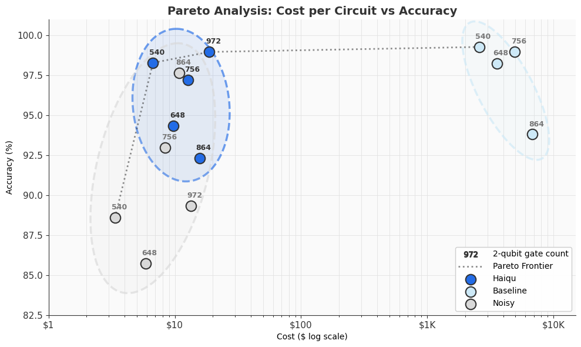

# Haiqu SDK Demos

A repository of Jupyter notebooks that showcase the capabilities of [Haiqu SDK](https://github.com/haiqu-ai/haiqu-sdk): a Python performance middleware package for running quantum circuits on real hardware with built-in error mitigation, state compression, data encoding and more. The notebooks have been pre-populated for convenience, but are reproducible on QPU if valid cretentials are provided. We encourage you to use these notebooks as starting point for your own research.

**Prerequsites:**
- Python **3.10+**
- `haiqu-sdk` package

To install `haiqu-sdk`, simply run
```bash
pip install haiqu-sdk
```
> [!TIP] 
> It is highly recommended to set up a Python virtual environment before package installation.
> Refer to [Haiqu SDK / Installation](https://github.com/haiqu-ai/haiqu-sdk#installation) for the full installation guide.

Some notebooks may also require additional external dependenices. Run `pip install -r requirements.txt` to install them if necessary. 

To use Haiqu SDK you need an API key. See [Haiqu SDK / Getting Access](https://github.com/haiqu-ai/haiqu-sdk#getting-access) for more details.

🔑 **Get an API key:** [haiqu.ai/contactform](https://haiqu.ai/contactform)\
📖 **Full documentation:** [docs.haiqu.ai](https://docs.haiqu.ai/)

## Example

In [`applications/kicked_ising/kicked_ising.ipynb`](applications/kicked_ising/kicked_ising.ipynb), a Floquet dynamics simulation of the kicked Ising model on 103 qubits takes ~3.1 hours and costs ~$17,856 with a PEC-based baseline. With Haiqu SDK, the same experiment runs in ~1 minute and costs ~$34 — a 531× cost reduction — while preserving accuracy close to the ideal result. See the [Contents](#contents) section for more notebooks.



*Accuracy vs. cost across 4 simulation depths (540–972 two-qubit gates). Haiqu (blue) consistently achieves higher accuracy at 2–3 orders of magnitude lower cost than the baseline at every depth. Experiment conducted on IBM Kingston device.*

## Contents

This repo is split into two sections:

**[`sdk-tutorials/`](sdk-tutorials/)**: Tutorial notebooks that showcase all major features in the Haiqu SDK. Each focuses on a set of function with a small, reproducible example. If you're new to Haiqu SDK or want to better understand how to use certain functions, start here.

**[`applications/`](applications/)**: End-to-end experiments run on real quantum hardware. These cover research-grade problems at realistic qubit counts and benchmark Haiqu against published baselines. Hardware access and cost make most of these impractical to re-run in full for most users, but cached results are included and all the code is there if you want to adapt or re-run the experiments yourself.

Please note that as the SDK evolves and new reseach applications appear, this repository is updated with new notebooks. Some results may also be updated to reflect the changes in the quantum hardware ecosystem.

## Where to start

Go through [`sdk-tutorials/run/haiqu_run.ipynb`](sdk-tutorials/run/haiqu_run.ipynb) first. It covers the core `haiqu.run()` API: job submission, result retrieval, and dry runs for cost estimation, and gives you a feel for basic Haiqu SDK workflow before moving on to more specific features.

## SDK Tutorial Notebooks

| Topic | Category | Notebook | Description |
|----------|------|------|-------------|
| `haiqu.run()` | SDK Basics | [haiqu_run.ipynb](sdk-tutorials/run/haiqu_run.ipynb) | Core circuit execution on QPUs and simulators. Covers job submission, result retrieval, dry runs, and job management. **Start here.** |
| `haiqu.run()` with `use_mitigation` | SDK Basics | [haiqu_run_use_mitigation.ipynb](sdk-tutorials/run/haiqu_run_use_mitigation.ipynb) | Lightweight error mitigation for sampling and expectation value tasks. For an adder circuit, mitigation boosts success probability from 17.3% to 85% (4.9x). |
| `haiqu.run()` with `error_mitigation_options` | SDK Basics | [haiqu_run_mitigation_options.ipynb](sdk-tutorials/run/haiqu_run_mitigation_options.ipynb) | Toggle individual mitigation layers on or off: dynamical decoupling, readout mitigation, noise tailoring, advanced mitigation. |
| `haiqu.run()` quality estimate | SDK Basics | [haiqu_run_quality_estimate.ipynb](sdk-tutorials/run/haiqu_run_quality_estimate.ipynb) | Per-circuit quality metrics: Hellinger fidelity for sampling tasks and relative error for observables. |
| `haiqu.run()` uncertainty estimate | SDK Basics | [haiqu_run_uncertainty_estimate.ipynb](sdk-tutorials/run/haiqu_run_uncertainty_estimate.ipynb) | How shot count and mitigation affect the statistical uncertainty of expectation values. |
| `haiqu.vector_loading()` | Data Encoding | [haiqu_vectorLoading.ipynb](sdk-tutorials/vectorLoading/haiqu_vectorLoading.ipynb) | Prepare quantum states from amplitude vectors. For a 12-qubit sin wave, 194x fewer CNOT gates than standard amplitude encoding. |
| `haiqu.block_vector_loading()` | Data Encoding | [haiqu_blockVectorLoading.ipynb](sdk-tutorials/blockVectorLoading/haiqu_blockVectorLoading.ipynb) | Tiled encoding for large 1D and 2D vectors. For a 64x64 image, achieves 97% fidelity vs 87% with standard vector loading. |
| `haiqu.distribution_loading()` | Data Encoding | [haiqu_distributionLoading.ipynb](sdk-tutorials/distributionLoading/haiqu_distributionLoading.ipynb) | Prepare probability distributions in quantum states with 194x fewer gates than standard methods. |
| `haiqu.isometry_encoding()` | Data Encoding | [haiqu_isometryEncoding.ipynb](sdk-tutorials/isometryEncoding/haiqu_isometryEncoding.ipynb) | Encode classical feature vectors into quantum states. 1000 features can fit in 100 qubits or fewer, controlled via a density parameter. |
| `haiqu.state_compression()` | Compression | [haiqu_stateCompression.ipynb](sdk-tutorials/stateCompression/haiqu_stateCompression.ipynb) | Reduce circuit depth to improve results on noisy hardware. For a 10-qubit adder: 11.5x improvement in success probability. |
| `haiqu.state_compression()` with `compression_level` | Compression | [haiqu_stateCompression_level.ipynb](sdk-tutorials/stateCompression/haiqu_stateCompression_compressionLevel.ipynb) | Trade off depth reduction against state quality using `low`, `balanced`, or `high` compression. |
| `haiqu.state_compression()` with `fine_tuning` | Compression | [haiqu_stateCompression_fineTuning.ipynb](sdk-tutorials/stateCompression/haiqu_stateCompression_fineTuning.ipynb) | Further improve compressed circuit quality with optional post-compression fine-tuning. |
| `haiqu.observable_backpropagation()` | Compression | [haiqu_observableBackpropagation.ipynb](sdk-tutorials/observableBackpropagation/haiqu_observableBackpropagation.ipynb) | Reduce circuit depth by absorbing layers into the measurement observable via Pauli backpropagation. Cuts 2-qubit gates by ~3x on a 193-qubit circuit. |
| `haiqu.variational_optimization()` | Variational Optimization, QML | [haiqu_variational_optimization.ipynb](sdk-tutorials/qml/haiqu_variational_optimization.ipynb) | Variational quantum optimization with the NFT gradient-free optimizer. Supports initial parameters, mitigation, and circuit packing. |
| `haiqu.solve_qubo()` | Variational Optimization, QUBO | [haiqu_solve_qubo.ipynb](sdk-tutorials/optimization/haiqu_solve_qubo.ipynb) | End-to-end QUBO solving with built-in LR-QAOA circuits and classical post-processing. |
| `haiqu.postprocess()` | Variational Optimization, QUBO | [haiqu_postprocess.ipynb](sdk-tutorials/optimization/haiqu_postprocess.ipynb) | Classical bit-flip post-processing to improve QUBO solutions without additional circuit runs. |

## Application Notebooks

| Topic | Category | Notebook | Description |
|----------|------|------|-------------|
| 127-Qubit Ising Model | Quantum Dynamics |[standard_ising.ipynb](applications/standard_ising/standard_ising.ipynb) | Transverse-field Ising model on 127 qubits: same accuracy as IBM's pipeline at 350x lower cost (~$33 vs ~$11,520). |
| 103-Qubit Floquet Ising Model | Quantum Dynamics | [kicked_ising.ipynb](applications/kicked_ising/kicked_ising.ipynb) | Kicked Ising model on 103 qubits: 531x cheaper than a PEC-based baseline (~$34 vs ~$17,856). |
| LiH VQE | Variational Algorithms | [lih_vqe.ipynb](applications/variational_optimization/lih_vqe.ipynb) | VQE for lithium hydride on 10 qubits: ~5x faster QPU time and ~5x lower cost vs Qiskit Runtime baseline. |
| 100-Qubit LR-QAOA (Coming Soon) | Variational Algorithms | Coming Soon | LR-QAOA for a 100-qubit weighted Max-Cut: Haiqu compression dominates the quality-cost tradeoff at every depth. |
| Quantum Image Encoding | Data Encoding |[main_estimation_block_with_qpu_res.ipynb](applications/image_encoding/main_estimation_block_with_qpu_res.ipynb) | Amplitude encoding of grayscale images on a QPU. Haiqu Block Vector Loading vs Qiskit StatePreparation across resolutions up to 256x256. |
| State Compression on 2D Heavy-Hex | Compression | [haiqu_stateCompression_2d.ipynb](applications/2d_compression/haiqu_stateCompression_2d.ipynb) | Up to 85% CNOT reduction on 156-qubit Floquet circuits on IBM Heron hardware, with >91% compression quality. |
| SKQD for Anderson Model | Hybrid Algorithms | [skqd_siam_model.ipynb](applications/skqd_demo/skqd_siam_model.ipynb) | Hybrid Krylov diagonalization for a 40-qubit SIAM: 3.4x lower energy error with 98% gate reduction. |

## Feedback and Support

If you have any questions, feedback, suggestions or want to request a demo, reach out to us

- **Request a demo:** [haiqu.ai/demoform](https://haiqu.ai/demoform/)
- **Sign up for an API key:** [haiqu.ai/contactform](https://haiqu.ai/demoform/)
- **Email:** [info@haiqu.ai](mailto:info@haiqu.ai)
- **Documentation:** [docs.haiqu.ai](https://docs.haiqu.ai/)
- **Issues and feature requests:** open an issue in this repository or visit [feedback.haiqu.ai](https://feedback.haiqu.ai/)